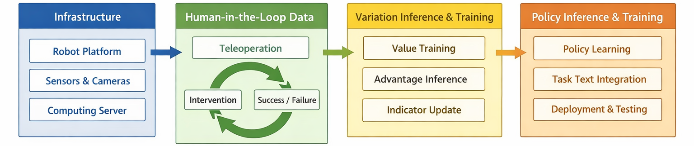

<h1 align="center">Evo-RL</h1>

<p align="center"><strong>Piper Mechanical Arm Specialized Edition</strong></p>

<p align="center">
  <a href="https://github.com/huggingface/lerobot"></a>
  <a href="./LICENSE"></a>
</p>

<p align="center"><strong>Architecture Overview</strong></p>

<p align="center">
  
</p>

## 项目定位

这个仓库已经从原始 Evo-RL 演化为一个 **面向 Piper / 双臂 Piper 的专用版本**，目标是把真实机器人上的采集、训练和推理链路收敛到一套更稳定、更容易维护的实现。

当前仓库重点保留并增强了以下能力：

- **Piper 专属机器人链路**：只保留 `piper` / `bi_piper` 相关机器人与 teleoperator 实现。
- **Flow 系列策略**：新增并维护 `fm`、`evo1` 等 flow/flow-matching 方向模型，同时保留当前仍在使用的 `a2a`、`original_a2a`、`abpolicy`、`vita`。
- **RTC 推理**：支持在推理阶段启用 `rtc`，用于更贴近真实部署场景的低延迟动作执行。
- **Values 核心链路**：保留 `values` 相关训练与推理能力，用于价值评估、优势标注和后续策略训练。
- **面向真实使用的脚本入口**：围绕你现在实际使用的 `teleoperate.sh`、`record.sh`、`train_xx.sh`、`lerobot_infer.sh` 组织仓库。

不再是当前主线的内容已经被大幅裁剪，包括大量非 Piper 机械臂、无关策略、历史示例和部分上游通用组件。

## 当前支持的主链路

如果你现在只做 Piper 真实机器人闭环，建议按下面这条链路使用：

1. `teleoperate.sh`
   用于检查双臂 Piper 遥操作链路是否正常。
2. `record.sh`
   用于采集数据集，保留真实机器人录制主流程。
3. `train.sh` / `train_ab.sh` / `train_fm.sh` / `train_vita.sh`
   用于训练不同策略或实验配置。
4. `lerobot_infer.sh`
   用于加载训练好的策略做真实机器人推理，支持 `rtc` 推理路径。

## 当前保留的核心模块

- `src/lerobot/robots/`
  只保留 `piper_follower` 和 `bi_piper_follower`。
- `src/lerobot/teleoperators/`
  只保留 `piper_leader`、`bi_piper_leader` 以及少量通用输入设备。
- `src/lerobot/policies/`
  当前实际主线策略为 `a2a`、`original_a2a`、`abpolicy`、`fm`、`vita`，并保留 `rtc` 推理模块。
- `src/lerobot/values/`
  这是当前 Evo-RL 版本的核心之一，保留价值模型训练和标注链路。

## 安装

```bash
git clone <your-fork-or-local-repo>
cd Evo-RL
conda create -y -n evo-rl python=3.10
conda activate evo-rl
pip install -e .
```

如果你依赖上游 LeRobot 的系统环境配置，可以参考官方安装文档：
<https://huggingface.co/docs/lerobot/installation>

## 硬件范围

这个版本默认服务于 **Piper / 双臂 Piper**。

你需要自行确认以下基础条件：

- 机械臂已经处于可控模式，并且 CAN 接口可用。
- 相机路径和分辨率已经提前确认。
- `lerobot-setup-can` 已能正确配置 CAN 设备。
- 训练和推理机器已经具备对应 CUDA / PyTorch 环境。

## 快速工作流

### 1) 遥操作联通性检查

先运行：

```bash
bash teleoperate.sh
```

这一步的目标是确认：

- 双臂 Piper 通信正常
- leader / follower 映射正常
- 相机和显示链路正常

### 2) 数据采集

运行：

```bash
bash record.sh
```

这一步用于采集真实机器人数据，并为后续 value 标注、策略训练和闭环迭代准备数据。

### 3) Value 训练与标注

如果当前实验需要价值模型链路，可以继续使用仓库中的 value 训练与推理脚本：

```bash
lerobot-value-train ...
lerobot-value-infer ...
```

这部分会为数据集生成价值、优势和二值 indicator，供后续策略训练使用。

### 4) 策略训练

按实验类型选择训练入口：

```bash
bash train.sh
bash train_ab.sh
bash train_fm.sh
bash train_vita.sh
```

当前仓库主要围绕以下策略展开：

- `a2a`
- `original_a2a`
- `abpolicy`
- `fm`
- `vita`

其中 `fm` / flow 系列是这个 Piper 专用版本新增和重点维护的方向之一。

### 5) 真实机器人推理

运行：

```bash
bash lerobot_infer.sh
```

该入口用于真实机器人推理部署，当前版本支持 `rtc.enabled=true` 的低延迟推理模式。

## Value 链路说明

`src/lerobot/values/` 是当前仓库的核心模块之一，不建议删除。它承担的职责包括：

- 训练价值模型
- 对数据集进行 value / advantage 推断
- 生成优势相关标签
- 为后续策略训练提供额外监督信号

如果你的实验依赖 Evo-RL 的优势条件训练思路，这部分就是主干，不是可选附件。

## 这个版本相对原始仓库的主要变化

- 仓库已经收敛为 **Piper 专属版本**，不再面向多种机械臂统一维护。
- 删除了大量当前不用的机器人、teleoperator、示例、测试和历史策略。
- 增加并整理了 **flow / flow-matching** 相关策略实现。
- 增强了真实部署侧的 **RTC 推理** 支持。
- 保留 `values` 为核心能力，并围绕真实机器人闭环继续使用。
- 脚本入口围绕真实工作流重新收敛，更适合长期本地迭代。

## 目录说明

- `teleoperate.sh`
  遥操作检查入口。
- `record.sh`
  数据采集入口。
- `train*.sh`
  训练入口集合。
- `lerobot_infer.sh`
  真实机器人推理入口。
- `src/lerobot/values/`
  value 模型与优势标注核心实现。
- `src/lerobot/policies/rtc/`
  RTC 推理相关实现。

## License

Apache-2.0. See [LICENSE](./LICENSE).
